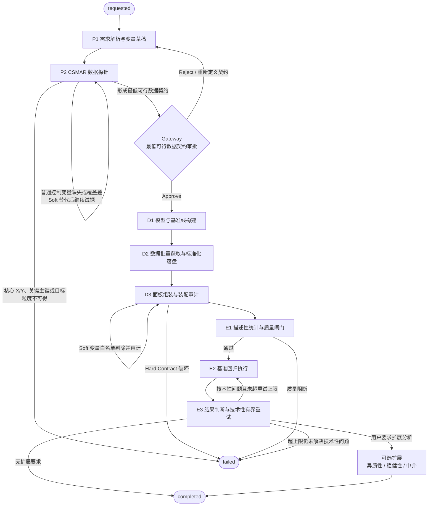

# 敏捷实证分析工作流架构方案 (V2)

本文档是 StataAgent 产品流程的单一事实来源，用于约束从研究请求到结果判断的完整实证分析链路。

## 一、 架构优化背景与核心理念

基于早期链路中存在的“理论规划与现实数据脱节”问题（即变量定义与数据实际获取的时空错位），V2架构从第一性原理出发，对实证研究工作流进行了核心解耦与重排。

**核心痛点解决**：

1. 滞后的“可行性灾难”：避免在模型构建完毕后才发现 CSMAR 数据缺失，导致整体大范围返工。
2. 无效的 Human-in-the-Loop 疲劳：停止让人类审核未经检验的“理论变量清单”，确立以真实数据可行性为前提的“契约审核”。
3. 脆弱的链条与缺乏妥协机制：引入局部降级设计，当非核心变量在后期合并中造成样本严重缩水时，允许记录审计日志并抛弃该变量，而不是全盘崩溃。

**核心工作流设计原则**：

- 快速试错：轻量级可行性探针前置，把“有没有数据、主键是否可对齐、覆盖是否过低”尽量提前暴露；若核心 X/Y 不可得则立即失败。
- 契约边界：仅设立唯一且核心的 Human-in-the-Loop 关卡，但契约分为 `Hard Contract` 与 `Soft Contract` 两层。
- 最小可行性：Gateway 只确认“最低可行数据契约”，不宣称 `100%` 无风险，残余风险必须显式披露。
- 节点单责：探针、批量抓取、面板组装、质量闸门、回归执行和结果判断应尽量分离。
- 有界降级：仅允许在 `Soft Contract` 和预声明的诊断性调整白名单内做有限妥协，拒绝因结果“不好看”而死循环调参。

---

## 二、 状态机执行链路

下图给出整个实证分析状态机的执行链路，其中 `node` 表示主执行节点，`edge` 表示状态推进、失败分支或有界重试回边。

---

## 三、 工作流链路设计 (三型阶段)

### 阶段一：可行性谈判 —— 确保“弹药库”充足

此阶段旨在通过前置的轻量级数据库嗅探，锁定实证所需的变量边界，隔离后续的 I/O 和计算负担。

- **Node P1: 需求解析与变量草稿**
  - 输入：用户以自然语言提交的研究需求，包括核心解释变量 X、被解释变量 Y、样本范围、时间范围、数据频率，以及动态给定的“实证部分要求”（例如：是否需要描述性统计、异质性、稳健性、中介等扩展分析）。
  - Agent Action：根据经济学知识库，初步推衍 X、Y，并拟定一组基础的控制变量 (Controls)。同时整理目标分析粒度、关键主键、时间键，以及用户明确要求交付的实证模块。
  - 边界约束：`Y`、`X` 以及用户显式要求的关键机制变量属于 `Hard Contract` 候选；普通控制变量属于 `Soft Contract` 候选。
  - 状态：此时不生成具体计量模型，也不通知用户审批。
- **Node P2: CSMAR 数据探针 (轻量级自动化试探)**
  - Agent Action：调用数据接口，但**不全量下载**。仅查询表结构元数据、记录计数或拉取极少样本记录，以验证 P1 拟定的变量在给定时间、频率和分析粒度下是否存在、是否可访问、主键是否可对齐、覆盖是否明显不足。
  - 内部容错循环：若探针反馈某一**普通控制变量**大量缺失或不存在，Agent 可以在同一经济含义范围内尝试寻找替代变量并继续试探，但必须记录 `Substitution Log`。若 `Y`、`X`、用户显式要求的关键变量、关键主键或目标时间粒度不可得，则不自动换义，直接 `fail fast`。
- **🟢 Gateway: 数据契约确立 (唯一强制的 Human in Loop)**
  - **输出**：向用户呈递《最低可行数据契约》，其中必须完整包含：变量定义表、分析粒度、样本框、时间范围、关键主键/时间键、用户要求交付的实证模块、允许自动剔除的变量列表、每项变量的探针覆盖摘要、`Substitution Log`，以及残余风险说明。
  - **契约分层**：
    - `Hard Contract`：`Y`、`X`、样本框、时间范围、分析粒度、关键主键和用户强约束变量。
    - `Soft Contract`：允许后续在约束内替换或剔除的普通控制变量清单，以及对应的探针覆盖摘要与 `Substitution Log`。
  - **用户决策 (HIL)**：用户审核此份可行性底表。一旦选择“确认 (Approve)”，`Hard Contract` 即被锁定，后续流程不得再因“没有数据”而重写研究问题；`Soft Contract` 仅允许按预先声明的规则做有限降级，并留下审计记录。

---

### 阶段二：理论建模与组装落地 —— 绝不走回头路

此阶段基于已经锁定的数据契约开展核心逻辑设定与繁重的数据拉取。

- **Node D1: 模型与基准线构建 (原理模型后置)**
  - 输入：Gateway 审核通过的“数据契约”。
  - Agent Action：此时方才确立数学方程式（如双向固定效应面板模型等），并基于经济学常识输出对核心系数 $\beta$ 的“预期符号判定基准线”。
  - 约束补充：同时声明一份最小的“诊断性调整白名单”，例如允许变更的标准误类型、允许尝试的固定效应层级、以及允许从 `Soft Contract` 中剔除的变量范围。该白名单必须在回归前确定，不能在看到结果后再临时发明。异质性、稳健性、中介等扩展分析不属于基准回归本体，仅在用户输入明确要求时挂接到基准回归之后执行。
- **Node D2: 数据批量获取与标准化落盘**
  - Agent Action：以契约为准，正式执行高成本的数据批量下载，并完成字段命名、单位、缺失值编码等标准化，输出标准化中间表。
  - 容错机制：因为“有没有数据”在上一阶段已尽量前置验证，此处的失败主要应对网络超时、数据包超限或分页抓取中断，Agent 直接执行底层的 API Retry 或分页断点续传。
  - 职责边界：此节点只负责 I/O 与标准化，不承担变量剔除、模型调整或研究语义修改。
- **Node D3: 面板组装与装配审计**
  - Agent Action：在标准化中间表基础上完成跨表主键对齐、宽长表转换与合并，构建单一分析长表。
  - 契约内降级：若某一 `Soft Contract` 控制变量在装配阶段导致样本量断崖式下跌或形成不可接受的合并代价，Agent 可以按白名单主动剥离该变量，并记录 **Audit Trail（变量剔除审计）**。
  - 硬边界：若问题涉及 `Hard Contract` 变量、关键主键、核心样本框或目标粒度，则立即失败，不再向后流转。

---

### 阶段三：执行验证与有界寻优

- **Node E1: 描述性统计与防爆控制**
  - Agent Action：在装配完成后的单一分析长表上执行描述性统计、逻辑校验、缺失与极值扫描；仅在主体数据通过质量门后，对连续变量执行缩尾极值处理（Winsorization 1%~99%）。
  - 职责边界：本节点只负责“质量确认与回归通行证”，不再承担变量替换或合并补救；前述降级动作必须已经在 D3 内完成并留下审计。
- **Node E2: 基准回归执行**
  - Agent Action：先生成并运行**基准回归**的 Stata 脚本代码，并将其结果永久保留为不可覆盖的基线输出。
  - 职责边界：本节点只负责执行基准回归，不承担结果解释或调参决策。
- **Node E3: 结果判断与技术性有界重试**
  - Agent Action：将基准回归结果与 Node D1 制定的“预期符号基准线”进行比对验证，并同时读取执行日志和诊断信息。
  - 内部容错调参循环 (有界限)：只有在出现**可诊断的技术性问题**时，Agent 才触发内部调优机制，例如：
    1. 筛除存在明确多重共线性的冗余控制变量。
    2. 变更已预声明的标准误类型（例如：加入个体聚类稳健标准误）。
    3. 在预声明白名单内增减时间、行业或其他高维固定效应。
  - 禁止事项：若基准回归仅仅是“违背预期符号”或“核心变量不显著”，但不存在明确技术性缺陷，Agent 不得为了追求显著性而继续自动搜索更好看的结果；应直接保留基准回归并如实报告。
  - **硬约束边界限制**：该内部寻优循环被严格约束在一至三次（例如：`Max_Retries = 3`）。若尝试额度用尽仍未解决技术性问题，Agent **强制中止挣扎**，如实提交基准结果、所有重试结果及试错日志。
  - **扩展输出**：异质性、稳健性、中介等扩展分析仅在用户输入明确要求时才追加执行，并作为基准回归之后的可选扩展结果输出。遵循实证第一性，不一味强求“好看的数据”。
